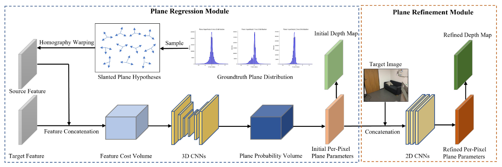

# PlaneMVS: 3D Plane Reconstruction from Multi-view Stereo (CVPR 2022)

[](https://oppo-us-research.github.io/PlaneMVS)
[](https://arxiv.org/abs/2203.12082)
[](https://youtu.be/yPoWc79XYsQ)
[](https://oppo-us-research.github.io/PlaneMVS/static/images/cvpr22_poster_PlaneMVS.pdf)
[](https://oppo-us-research.github.io/PlaneMVS/static/images/cvpr22_slide_PlaneMVS.pdf)


This is an official PyTorch implementation of the paper: 

> **PlaneMVS: 3D Plane Reconstruction From Multi-View Stereo**
> 
> [Jiachen Liu](https://scholar.google.com/citations?user=NSeLtc0AAAAJ&hl=en)<sup>\*;&ddagger;1,2</sup>, 
[Pan Ji](https://sites.google.com/view/panji530)<sup>&dagger;1</sup>, 
[Nitin Bansal](https://scholar.google.com/citations?user=h_Hym_8AAAAJ&hl=en)<sup>1</sup>, 
[Changjiang Cai](https://www.changjiangcai.com/)<sup>&dagger;&ddagger;1</sup>, 
[Qingan Yan](https://yanqingan.github.io/)<sup>1</sup>, 
[Xiaolei Huang](https://scholar.google.com/citations?user=iTtzc1UAAAAJ&hl=en)<sup>2</sup>, 
[Yi Xu](https://scholar.google.com/citations?user=ldanjkUAAAAJ&hl=en)<sup>1</sup> </br>
>
> <sup>1</sup> OPPO US Research Center, 
<sup>2</sup> Penn State University </br>
>
> <sup>*</sup> Work done as an intern at OPPO US Research Center   
> <sup>&dagger;</sup> Corresponding author  
> <sup>&ddagger;</sup> Code development and maintenance </br>  

<p align="center">
  
</p>


## 🆕 Updates

- 06/10/2024: Official code initially released per institutional approval.
- 06/01/2022: PlaneMVS paper released, see arXiv [paper](https://arxiv.org/abs/2203.12082).

## 📋 Table of Contents
1. [✨ Highlights](#highlights)
2. [⚙️ Setup](#setup)
3. [💾 Data Preparation for Training](#data-preparation)
4. [🍀 Our Code Structure](#code-structure)
   - [Model Definition 🕸](#model)
   - [Config Parameters 📝](#config)
   - [ScanNet Dataloader 🔃](#scannet-dataloader)
   - [Adding Your Own Dataloader 💽](#new-dataloader)
5. [🏋️ Model Weights](#model-weights)
   - [ResNet50-FPN Backbone](#resnet50-fpn-backbone)
   - [Our Model Checkpoints](#our-model-checkpoints)
6. [⏳ Training](#training)
7. [📊 Testing and Evaluation](#testing-and-evaluation)
8. [⚖️ License](#license)
9. [🙏 Acknowledgements](#acknowledgements)
10. [📑 Citations](#citations)


## ✨ Highlights <a id="highlights"></a>

- Our framework PlaneMVS supports:
  - Semantic Dense Mapping: Simultaneously perform semantic plane detection and dense 3D reconstruction.
  - Multi-view inputs: multi-view input RGB images or monocular RGB videos to recover the 3D scale without suffering scale ambiguity compared with single-view counterparts.

- Our implementation gives an upgraded [maskrcnn_benchmark](third_party/maskrcnn_main/maskrcnn_benchmark) to support latest PyTorch and CUDA Compilation. The code has been tested in the following environment:
  - PyTorch 2.2.0+cu121, Python 3.10, Ubuntu 22.04.4, via a virtual environment and a docker container(See details in [Setup](#setup)).

- 🗣 Why to upgrade maskrcnn-benchmark?
  - Our PlaneMVS is implemented based on maskrcnn-benchmark. The original benchmark has been deprecated. It can be compiled only in old PyTorch (e.g., 1.6.0) but still cannot be supported by new GPUs. E.g., when compiling it with PyTorch 1.6.0 on a RTX3090 GPU, errors will be seen
  ```plain
  Error: NVIDIA GeForce RTX 3090 with CUDA capability sm_86 is not compatible with the current PyTorch installation. The current PyTorch install supports CUDA capabilities sm_37 sm_50 sm_60 sm_70 sm_75.
  ```
  - Therefore, we upgrade [maskrcnn_benchmark](third_party/maskrcnn_main/maskrcnn_benchmark) to support latest CUDA and PyTorch and GPUs. The updates mainly include:
    -  `csrc` cuda kernels under [third_party/maskrcnn_main/maskrcnn_benchmark/csrc/cuda/](third_party/maskrcnn_main/maskrcnn_benchmark/csrc/cuda/). For example, see the modification to the file [cuda/ROIAlign_cuda.cu](third_party/maskrcnn_main/maskrcnn_benchmark/csrc/cuda/ROIAlign_cuda.cu).
    -  several layers using the `csrc` kernels under [third_party/maskrcnn_main/maskrcnn_benchmark/layers](third_party/maskrcnn_main/maskrcnn_benchmark/layers). For example, you can check the modification in the file [layers/roi_align.py](third_party/maskrcnn_main/maskrcnn_benchmark/layers/roi_align.py).
  - Now, it is quite convenient to run our code in your machine with modern GPUs and do not worry about the deprecated issues caused by maskrcnn_benchmark.

- Our implementation supports multi-GPU DDP (Distributed Data Parallel) and DP (Data Parallel) training, and single-gpu inference.

## ⚙️ Setup <a id="setup"></a>

Our code has been successfully tested in the following environment:

- PyTorch 2.2.0+cu121, Python 3.10, Ubuntu 22.04.4.


To setup that environment and replicate our experimental results, please follow those steps.

**Step 1**: Download our code
```bash
# Clone the repo.
git clone https://github.com/oppo-us-research/PlaneMVS.git

# We assume PROJ_ROOT as the project directory.
# E.g., PROJ_ROOT=~/PlaneMVS
cd $PROJ_ROOT
```

**Step 2**: Configure a Docker environment 

- Follow the steps to install the Docker environment:
```bash
# assume you are in the PROJ_ROOT via cd $PROJ_ROOT
cd $PROJ_ROOT

## Build Docker image
cd docker && sh build.sh
# After the docker image is successfully built, 
# now you can run a Docker container
sh run.sh

## (Optional) [Useful Tips ✍]: To exit Docker container without stopping it, press Ctrl+P followed by Ctrl+Q; 
# If you want to exit the container's interactive shell session, 
# but do not want to interrupt the processes running in it,
# press Ctrl+P followed by Ctrl+Q. 
# This operation detaches the container and 
# allows you to return to your system's shell.

## (Optional) [Useful Tips ✍]: Re-enter the Container
# get the container id
docker ps
#  Run as root, e.g., if you want to install some libraries via `pip`;
#  Here `d89c34efb04a` is the container id;
docker exec -it -u 0 d89c34efb04a bash
#  Run as regular user
docker exec -it d89c34efb04a bash

## (Optional) [Useful Tips ✍]: To save the container to a new docker image;
# After the pip installation, save the container to an image. 
# You can run the following from the outside of the docker container.
docker commit -m "some notes you specified" d89c34efb04a ccj/planemvs:1.1
```

**Step 3**: Compile the maskrcnn_benchmark

```bash
cd $PROJ_ROOT
# to compile the cuda code, and generate '*.so' lib
# i.e., `third_party/maskrcnn_main/build/lib/maskrcnn_benchmark/_C.cpython-310-x86_64-linux-gnu.so`
./compile.sh
```
- Please note that here we do not want to install the library in the system-level, like `/usr/local/*` via something like `pip install maskrcnn_benchmark`. Instead, we prefer to just build the libs in the local `build` directory in this project.

- After running `./compile.sh` to compile the CUDA codes (including: `maskrcnn_benchmark/csrc/cuda/*.cu`), it will generate the `*.so` library at `third_party/maskrcnn_main/build/lib/maskrcnn_benchmark/_C.cpython-310-x86_64-linux-gnu.so`.

- We will explicitly load the `*.so`, for example, as shown in the file [roi_align.py](third_party/maskrcnn_main/maskrcnn_benchmark/layers/roi_align.py) as:
  ```python
  from build.lib.maskrcnn_benchmark import _C
  ```

After running those three steps, you have finished the configuration and ready to run the code at your will.

## 💾 Data Preparation for Training <a id="data-preparation"></a>

### [ScanNetv2 Dataset](https://github.com/ScanNet/ScanNet)

We assume you have downloaded the [ScanNetv2 dataset](https://github.com/ScanNet/ScanNet). Or you can have a look at [this](https://github.com/nianticlabs/simplerecon?tab=readme-ov-file#-scannetv2-dataset) by [SimpleRecon](https://github.com/nianticlabs/simplerecon) about how to download ScanNetv2.

Now we will focus on how to collect the plane annotation for network training.

- `Step 1. Download plane annotation from PlaneRCNN.` 
  - You will need to first download the plane annotation provided by [PlaneRCNN](https://github.com/NVlabs/planercnn) and put the annotation directory separately into each scene of the ScanNet. Please check the PlaneRCNN repo about [Training data preparation](https://github.com/NVlabs/planercnn#training-data-preparation).
  - Then, unzip the raw semantic label archive (scene*_2d-label.zip) for each scene. 
  - The ScanNet dataset directory is expected to have the following structure:

```
└── scannet_data #scannet main directory
    └── scans
    │   ├── scene0000_00
    │   │   ├── annotation
    │   │   │   ├── plane_info.npy
    │   │   │   ├── planes.npy # plane parameters which are represented in the global frame;
    │   │   │   └── segmentation #  Plane segmentation for each image view;
    │   │   │       ├── 0.png
    │   │   │       ├── 1.png
    │   │   │       ├── ...
    │   │   ├── frames
    │   │   │   ├── color
    │   │   │   │   ├── 0.jpg
    │   │   │   │   ├── 1.jpg
    │   │   │   │   ├── ...
    │   │   │   ├── depth
    │   │   │   │   ├── 0.png
    │   │   │   │   ├── 1.png
    │   │   │   │   ├── ...
    │   │   │   ├── intrinsic
    │   │   │   │   ├── extrinsic_color.txt
    │   │   │   │   ├── extrinsic_depth.txt
    │   │   │   │   ├── intrinsic_color.txt
    │   │   │   │   ├── intrinsic_depth.txt
    │   │   │   └── pose
    │   │   │   │   ├── 0.txt
    │   │   │   │   ├── 1.txt
    │   │   │   │   ├── ...
    │   │   ├── label-filt
    │   │   │   ├── 0.png
    │   │   │   ├── 1.png
    │   │   │   ├── ...
    │   ...
    │   ├── scene0000_01
    │   │   ├── ...
    │   ...
    │
    └── scannetv2-labels.combined.tsv
```

- `Step 2: mount to ./datasets/scannet_data`: Mount the prepared ScanNet dataset to the local dir `./datasets/scannet_data` via
  ```bash
  ln -s SCANNET_DATA_DIR $PROJ_ROOT/datasets/scannet_data
  ```

- `Step 3: Stereo Data Cleaning and Generation`: For stereo data generation, please run the python script [data_preparation/stereo_pre_process.py](data_preparation/stereo_pre_process.py).
  - By running it, we clean the raw plane segmentation from [PlaneRCNN](https://github.com/NVlabs/planercnn) and save the cleaned segmentation into `cleaned_seg_dir` which is specified in [src/config/paths_catalog.py](src/config/paths_catalog.py).
  ```python
        # this is the main dataloader we used for training on ScanNet;
        "scannet_stereo_train": { 
            #these <key: value> elements should follow the arguments in __init__() of some Dataset;
            # for example: ScannetStereoDataset defined in src/datasets/scannet_stereo.py;
            #you can see the __init__(...) has the same args as below:
            
            "data_root": pjoin(DATA_DIR, "scannet_data/scans"),
            "data_split_file": "splits/sampled_stereo_train_files.txt",
            "cleaned_seg_dir": pjoin(DATA_DIR, "scannet_data/deltas_split_stereo_cleaned_segmentation"),
            "anchor_normal_dir": pjoin(DATA_DIR, "scannet_data/anchor_normals.npy"),
            "semantic_mapping_dir": "scannet_label_mapping",
            "pixel_plane_dir": pjoin(DATA_DIR, "sampled_pixel_planar_map"),
            "use_new_mapping": False,
            "split": "train",
            "mode": "mask"
        },
  ```
  -  The train/val split will also be generated and saved at `data_preparation/scannnet_splits/cleaned_scannet_stereo_train/val_files.txt`. Make sure to move them into `splits` directory to follow the path of `data_split_file`. We maintain a list of `*.txt` files for different data splits. Please see [splits](./splits/) for more details.


NOTE 📢: We recommend to make a soft link to mount your dataset to the local dir `./datasets`. Otherwise, you have to configure your own dataset paths by modifying [src/config/paths_catalog.py](src/config/paths_catalog.py).

## 🍀 Our Code Structure <a id="code-structure"></a>

### Model Definition 🕸 <a id="model"></a>

-  Our PlaneMVS model is defined at [src/models/detector/planestereo.py](src/models/detector/planestereo.py)

### Config Parameters 📝 <a id="config"></a>

The default model configuration parameters are defined at [src/config/defaults.py](src/config/defaults.py), and the data path parameters is listed at [src/config/paths_catalog.py](src/config/paths_catalog.py).

The model checkpoint loader is definied at [src/utils/checkpoint.py](src/utils/checkpoint.py).

### ScanNet Dataloader 🔃 <a id="scannet-dataloader"></a>

- `ScanNet Dataloader`: Our main dataloader for training and testing on ScanNet dataset is defined at [src/datasets/scannet_stereo.py](src/datasets/scannet_stereo.py).

- Our model is also tested on multiple indoor multi-view datasets (e.g., [7-Scenes](https://www.microsoft.com/en-us/research/project/rgb-d-dataset-7-scenes/), [TUM-RGBD](https://cvg.cit.tum.de/data/datasets)). You can find those dataloader for inference at [src/datasets/seven_scenes_stereo.py](src/datasets/seven_scenes_stereo.py) and [src/datasets/tum_rgbd_stereo.py](src/datasets/tum_rgbd_stereo.py), respectively.

### Adding Your Own Dataset and Dataloader 💽 <a id="new-dataloader"></a>

Adding support for training on a new dataset can be done as [src/datasets/scannet.py](src/datasets/scannet.py) (as parent class) and [src/data/datasets/scannet_stereo.py](src/data/datasets/scannet_stereo.py) (as child class).

Once you have created your dataset, it needs to be registered in a couple of files:
- [`src/datasets/__init__.py`](src/datasets/__init__.py): import this dataset similar to that `from .scannet_stereo import ScannetStereoDataset`, and add it to `__all__`;

- [`src/config/paths_catalog.py`](src/config/paths_catalog.py): `DatasetCatalog.DATASETS` and corresponding `if` clause in `DatasetCatalog.get()`.

## 🏋️ Model Weights <a id="model-weights"></a>

### ResNet50-FPN Backbone

We need to first download the `resnet50-FPN` maskrcnn (model id: 6358792) pre-trained models to initialize PlaneRCNN detection head, which can be found in [MODEL_ZOO.md](https://github.com/facebookresearch/maskrcnn-benchmark/blob/master/MODEL_ZOO.md). Please download that model and put it into the path you set at `MODEL.WEIGHT` as specified in the yaml file [configs/plane_cfgs/planestereo.yaml](configs/plane_cfgs/planestereo.yaml). For example, we set `WEIGHT: "checkpoints/saved/mask_rcnn/e2e_mask_rcnn_R_50_FPN_1x.pth"`.


### Our Model Checkpoints

We provide several [model checkpoints](https://www.dropbox.com/scl/fo/z8lc78o56mq424ey760g4/AB21vshaFYjEIn0i1sboUbg?rlkey=ip85luaxy8qo97n13vjdcn341&st=aaxj6hmn&dl=0) trained on ScannNetv2, by varying the training data size, training epoch and batch size, and so on. 

While the model configuration is specified by the yaml file [`planestereo.yaml`](configs/plane_cfgs/planestereo.yaml), other parameters can be changed dynamically in their scripts in the following formats:

- Data size: 1) setting `MODEL.STEREO.USE_ALL_DATA "True"` will load a large training data (#samples=67k), specified by the split txt file [valid_stereo_train_files.txt](splits/valid_stereo_train_files.txt). 2) setting `MODEL.STEREO.USE_ALL_DATA "False"` will load a relatively smaller training data (#samples=20k), specified by the split txt file [sampled_stereo_train_files.txt](splits/sampled_stereo_train_files.txt).

- Training, e.g., `NUM_EPOCHS`, `BATCH_SIZE`, `BASE_LEARNING_RATE` can be changed in the scripts (see below). 


| Experiments | Config.  |  Training <br> Time | Depth <br> AbsDiff↓| Depth <br> SqRel↓ | Depth <br> RMSE↓| Depth <br> $\delta$<1.25↑ | Detection <br> AP $^{0.2m}$↑ | Detection <br> AP $^{0.4m}$ ↑| AP↑| mAP↑| 
|----|----|----|----|----|----|----|----|----|----|----|
| [model ckpt @Exp1](https://www.dropbox.com/scl/fi/4pfhl27864oqo2dk5t2s7/model_final_exp01.pth?rlkey=75sbre0o7gew129wnetwmub2e&st=0kcb8txo&dl=0) <ul> <li>[run_train_exp01.sh](scripts/run_train_exp01.sh)</li> <li>[`planestereo.yaml`](configs/plane_cfgs/planestereo.yaml) </li>  </ul> | <ul><li> single-GPU training </li> <li> sampled data (#samples=20k) </li> <li> BS=6,LR=0.003,Epoch=10 </li> </ul> | 24 hrs | 0.088 | 0.027 | 0.186 | 0.925 | 0.441  |  0.516|  0.542| 0.491|
| [model ckpt @Exp2](https://www.dropbox.com/scl/fi/530d68iikd8jzijzjxoye/model_final_exp02.pth?rlkey=nnzof37r6i9pzenvmprc75gvo&st=05v8s4ai&dl=0) <ul> <li>[run_train_exp02.sh](scripts/run_train_exp02.sh)</li> <li>[`planestereo.yaml`](configs/plane_cfgs/planestereo.yaml) </li> </ul>| <ul><li> single-GPU training </li> <li> all data (#samples=67k) </li> <li> BS=6,LR=0.003,Epoch=10 </li> </ul> | 70 hrs | 0.083 | 0.023 | 0.175 | 0.936 | 0.459 | 0.533| 0.553 | 0.519| 
| Our best 🎯 [model ckpt @Exp3](https://www.dropbox.com/scl/fi/jmk8u26kihuztk1ugxcvj/model_final_exp03.pth?rlkey=qmo9asj44m3zttkpbab1y490v&st=c3npy11i&dl=0) <ul> <li>[run_train_exp03.sh](scripts/run_train_exp02.sh)</li> <li>[`planestereo.yaml`](configs/plane_cfgs/planestereo.yaml) </li> </ul> | <ul><li> 2-GPU training </li> <li> all data (#samples=67k) </li> <li> BS=16,LR=0.003,Epoch=10 </li> </ul> | 53 hrs | **0.081** | **0.022** | **0.170** | **0.939** | **0.477** |  **0.551** | **0.571** | **0.541** | 
| [model ckpt @Exp4](https://www.dropbox.com/scl/fi/f55nzxs8s52yfyi2rwwbs/model_final_exp04.pth?rlkey=hc41cdwspgrlucl8lsro6iih3&st=eo8cah0a&dl=0) <ul> <li>[run_train_exp04.sh](scripts/run_train_exp02.sh)</li> <li>[`planestereo.yaml`](configs/plane_cfgs/planestereo.yaml) </li> </ul>| <ul><li> 2-GPU training </li> <li> sampled data (#samples=20k) </li> <li> BS=16,LR=0.0003,Epoch=20 </li> </ul> | 20 hrs | 0.089 | 0.027 | 0.186 | 0.925 | 0.443 | 0.522| 0.545 | 0.481|
## ⏳ Training <a id="training"></a>

### Training on ScanNet

Run the python script [train_net.py](train_net.py) for network training. We provide several bash scripts to run the training on ScanNet, e.g., [run_train_exp03.sh](scripts/run_train_exp03.sh).

```bash
# DDP training on 2-GPU: GPU 0 and GPU 1; 
scripts/run_train_exp03.sh 0,1 
```

### Resume
Sometimes you have to stop and resume the training due to NaN loss (check this [issue #33](https://github.com/facebookresearch/maskrcnn-benchmark/issues/33)) after several training iterations.

To resume training a process, make sure there is a file in your `./checkpoints/some_exp_folder/last_checkpoint`. This `last_checkpoint` automatically points to the most recent checkpoint, e.g., it points to the file `./checkpoints_nfs/exp01-planemvs-epo10-bs6-dgx10/model_final.pth`. 

Then just set `IS_RESUME='true` in the bash script and run it to load previous model weights, optimizer and scheduler to resume the network training.

## 📊 Testing and Evaluation <a id="testing-and-evaluation"></a>

Now you can run [test_net.py](test_net.py) for testing and evaluation. We provide several bash scripts to run the testing on ScanNet, e.g., [run_test_exp03.sh](scripts/run_test_exp03.sh).

```bash
# single GPU inference on GPU 0; 
scripts/run_test_exp03.sh 0

# (Optional) Or if you want to save terminal output to a .txt file;
scripts/run_test_exp03.sh 0 2>&1 | tee results/tmp_results.txt
```

It will give you the following depth metrics and detection metrics.

```plain
ccj@5b8fddfb3476:~/code/planemvs_proj$ ./runfiles/run_test_exp03.sh 0
[***] inference device = cuda
[****] Loading checkpoint from ./checkpoints_nfs/exp03-alldata-planemvs-epo10-bs16-dgx10/model_final.pth
building dataset using Dataset class  ScannetStereoDataset for scannet_stereo_val ...
100%|████████████████████████████| 950/950 [20:30<00:00,  1.30s/it]
Mean AP: [0.477 0.551 0.566 0.571 0.571]
Mean mAP: 0.5408594040438236
Mean PlaneSeg: [1.381 0.845 0.714]
Mean Planar Depth Metrics for Whole Img: [0.092 0.035 0.081 0.022 0.17  0.107 0.939 0.991 0.998]
Mean Pixel-Planar Depth Metrics for Whole Img: [0.095 0.036 0.083 0.023 0.174 0.109 0.936 0.991 0.998]
Mean Planar Depth Metric using gt masks for Whole Img: [0.088 0.034 0.081 0.021 0.165 0.104 0.943 0.992 0.998]
Mean Pred-Planar-Area Depth Metrics: [0.072 0.032 0.075 0.017 0.143 0.094 0.95  0.994 0.999]
Mean Gt-Planar-Area Depth Metrics: [0.078 0.033 0.076 0.018 0.149 0.097 0.948 0.993 0.999]
Mean Refined Gt-Planar-Area Depth Metrics: [0.077 0.033 0.076 0.018 0.149 0.097 0.948 0.993 0.999]
Mean Gt-Planar-Area Pixel-Planar Depth Metrics: [0.084 0.034 0.079 0.02  0.156 0.101 0.943 0.993 0.999]
========== img semantics(consider every pixels) ==========
{'Pixel Accuracy': 0.7544948156524123, 'Mean Accuracy': 0.6183070794385185, 'Frequency Weighted IoU': 0.6202744571246841, 'Mean IoU': 0.5111661750637606, 'Class IoU': {0: 0.5117866472963567, 1: 0.7441619843595424, 2: 0.46830892233623095, 3: 0.7841726233489069, 4: 0.5992126295858932, 5: 0.4093309051899402, 6: 0.5224285534707567, 7: 0.29198417923629466, 8: 0.44792802188280134, 9: 0.4074677811908966, 10: 0.3752509771344273, 11: 0.5719608757330807}}
========== Mean Plane Normal Diff: ==========
0.251
========== Mean Plane Offset Diff: ==========
0.193
========== Mean Plane n/d Diff: ==========
0.333
========== Mean Plane Geometric Diff: ==========
0.603
========== Median Plane Geometric Diff: ==========
0.285
========== Weighted Mean Plane Geometric Diff: ==========
0.258
```

Please also check the validation metrics of depth and detection evaluation for `Our best 🎯 model ckpt @Exp3` as shown in the table above.

## ⚖️ License <a id="license"></a>

PlaneMVS is licensed under [MIT licence](./LICENSE). For the third party [maskrcnn-benchmark]((https://github.com/facebookresearch/maskrcnn-benchmark)), please refer to its [MIT license](https://github.com/facebookresearch/maskrcnn-benchmark/blob/main/LICENSE). 

## 🙏 Acknowledgements <a id="acknowledgements"></a>
Our work adopts codes from [maskrcnn-benchmark](https://github.com/facebookresearch/maskrcnn-benchmark). We sincerely thank the owners for open sourcing their project.

## 📑 Citations <a id="citations"></a>
If you find our work useful, please consider citing our paper:

```plain
@InProceedings{liu2022planemvs,
    author    = {Liu, Jiachen and Ji, Pan and Bansal, Nitin and Cai, Changjiang and Yan, Qingan and Huang, Xiaolei and Xu, Yi},
    title     = {PlaneMVS: 3D Plane Reconstruction From Multi-View Stereo},
    booktitle = {CVPR},
    month     = {June},
    year      = {2022},
    pages     = {8665-8675}
}
```

Please also consider our another MVS paper if you find it useful:

```plain
@InProceedings{cai2023riavmvs,
    author    = {Cai, Changjiang and Ji, Pan and Yan, Qingan and Xu, Yi},
    title     = {RIAV-MVS: Recurrent-Indexing an Asymmetric Volume for Multi-View Stereo},
    booktitle = {CVPR},
    month     = {June},
    year      = {2023},
    pages     = {919-928}
}
```

and a neural active reconstruction paper if you find it helpful:

```plain
@article{feng2024naruto,
  title={NARUTO: Neural Active Reconstruction from Uncertain Target Observations},
  author={Feng, Ziyue and Zhan, Huangying and Chen, Zheng and Yan, Qingan and Xu, Xiangyu and Cai, Changjiang and Li, Bing and Zhu, Qilun and Xu, Yi},
  journal={arXiv preprint arXiv:2402.18771},
  year={2024}
}
```
